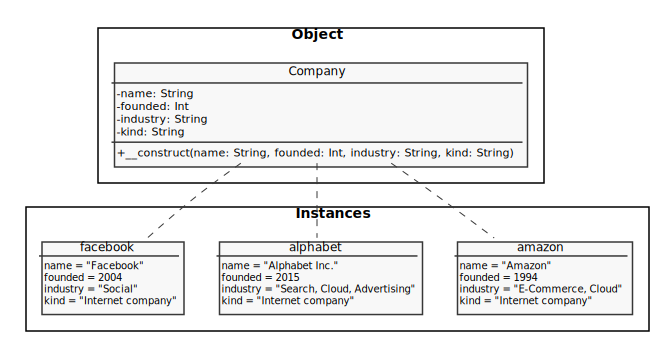
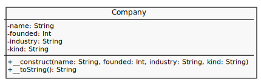
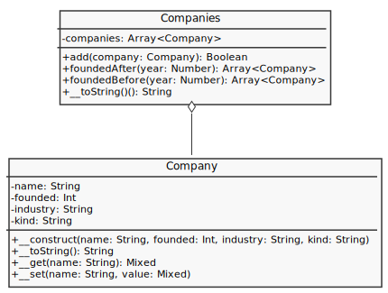

# Company

Crie uma variável que contenha as informações desta tabela:

| Name          | Founded | Industry                   | kind             |
| ------------- | ------- | -------------------------- | ---------------- |
| Amazon        | 1994    | E-Commerce, Cloud          | Internet company |
| Alphabet Inc. | 2015    | Search, Cloud, Advertising | Internet company |
| Facebook      | 2004    | Social                     | Internet company |

Uma das formas de estruturação desta tabela pode ser por meio da classe do diagrama a seguir:



Portanto, crie a classe `Company` conforme o diagrama a seguir:



Contudo, o resultado do método `__toString()` deve ser o nome (sempre com tamanho de 15) e ano de fundação da empresa:

```
Amazon.........1994
```

Crie também a classe `Companies` para agrupar uma coleção de `Company`:



no método `__toString()` da classe `Companies` o resultado final deve ser:

```
Alphabet Inc...2015
Amazon.........1994
Facebook.......2004
```

Para auxiliar todos os teste veja o arquivo `{{ page.path | replace:'README.md','' }}code/print/companies.print.php`:

```php

```

> Resposta: [company.php](response/src/company.php) e [companies.php](response/src/companies.php)
